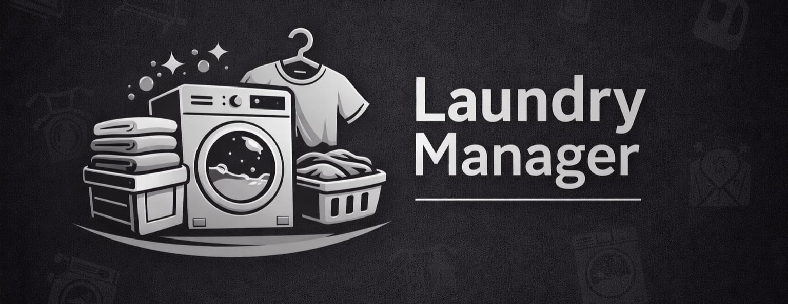

  

# 👔 Laundry Manager

¿Tienes ropa en la lavandería y nunca sabes si ya la devolvieron? **Laundry Manager** es una app Android gratuita que te ayuda a llevar el control de todas tus prendas — sin complicaciones, sin internet y sin publicidad.

## ¿Qué hace?

Registras tus prendas una sola vez y la app te ayuda a saber exactamente en qué estado está cada una: si está guardada en casa, si la enviaste a lavar o si ya te la devolvieron. Cuando la vuelves a enviar a la lavandería, no tienes que volver a registrarla — simplemente cambias el estado y listo.

## ¿Para quién es?

Para cualquier persona que maneje ropa en lavandería, ya sea en casa o en un negocio. Si eres el único usuario puedes configurarla para que sea ultra simple — sin campos innecesarios. Si la usas en un negocio con varios clientes, activa el **modo empresa** y filtra las prendas por propietario.

## Lo que puedes hacer

- 📸 **Foto de la prenda** — tómala con la cámara o selecciónala de la galería para identificarla fácilmente
- 🏷️ **Categorías** — organiza por Camisa, Pantalón, Chaqueta y más. Puedes crear las tuyas
- 🔄 **Cambio de estado** — con una flecha o con un selector directo, como prefieras
- 🔍 **Buscador** — encuentra cualquier prenda por nombre, propietario o categoría
- 👥 **Modo empresa** — gestiona prendas de múltiples clientes y filtra por usuario
- 🌙 **Modo oscuro** — porque la vista también importa
- 🔢 **Contador por estado** — ve de un vistazo cuántas prendas hay en cada grupo
- ✨ **Descripción automática** — la app describe la prenda por ti si no quieres escribir nada

Todo funciona **sin conexión a internet**. Tus datos se guardan localmente en tu teléfono y no se pierden aunque cierres la app.

## 📥 Descarga

Puedes descargar el APK más reciente directamente desde la sección de **[Releases](../../releases/latest)** de este repositorio. Solo descarga el archivo `.apk`, ábrelo en tu Android y acepta la instalación.

> Si tu teléfono te pregunta si confías en la fuente, ve a **Ajustes → Seguridad → Permitir fuentes desconocidas** y vuelve a intentarlo.

La app se actualiza automáticamente — cuando haya una nueva versión te aparecerá un aviso dentro de la app para instalarla con un solo toque.

## 🛠️ Stack técnico

Construida con Flutter y Clean Architecture, Riverpod para el estado, Hive para la persistencia local y fpdart para el manejo de errores.

## 🤖 Desarrollada con IA

Este proyecto fue desarrollado con un flujo de trabajo asistido por inteligencia artificial:

- **NotebookLM** — estructura del prompt y especificación técnica inicial
- **Claude (Anthropic)** — generación del código, arquitectura y tests
- **ChatGPT** — resolución de errores menores durante la implementación

## 📄 Licencia

The Unlicense — úsala, modifícala, compártela. Es tuya.
